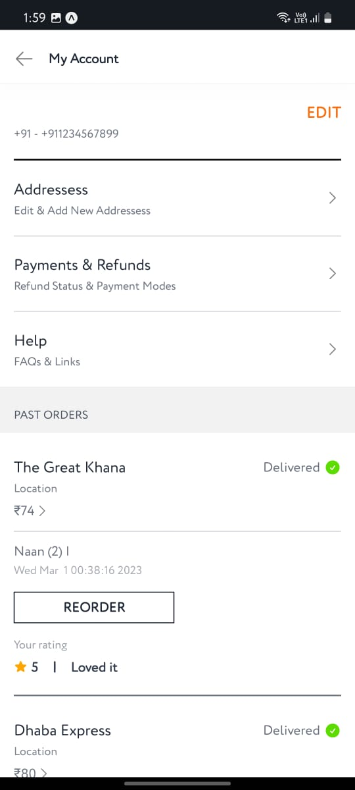
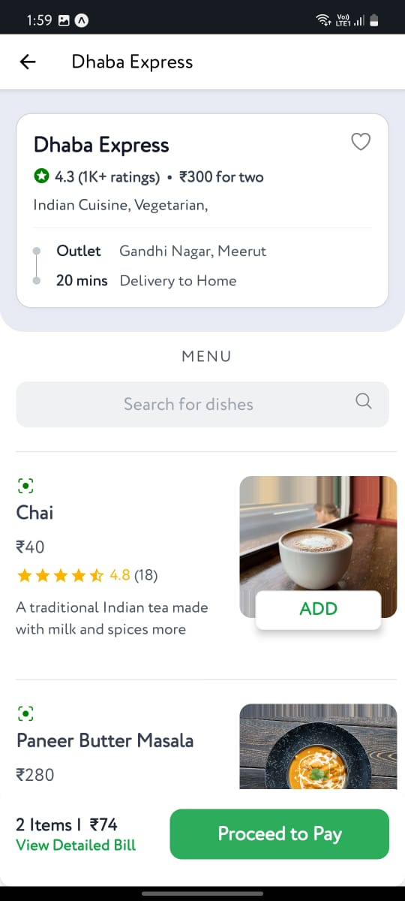
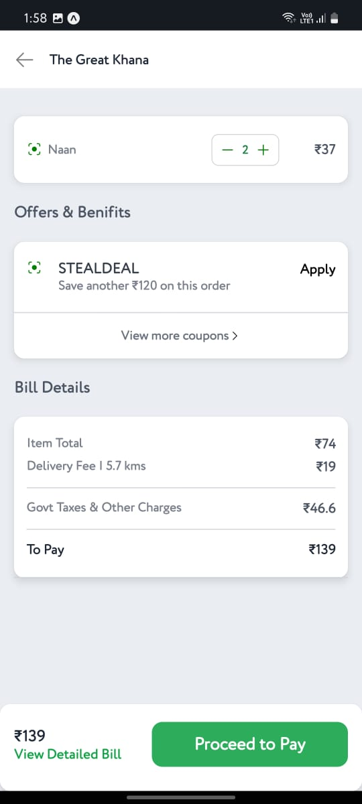

# EatsXpress - React Native Food Delivery App

EatsXpress is a mobile application built using React Native that allows users to order food from their favorite restaurants. Inspired by popular food delivery apps like Swiggy, EatsXpress provides a seamless and user-friendly experience for ordering delicious meals. This repository contains the source code for EatsXpress, which utilizes various technologies, including React Native, Redux, Firebase, Reanimated, and Git.

## Features

- User authentication using Firebase.
- Real-time updates for order status and restaurant information.
- Ordering functionality with a user-friendly interface.
- Order history to track previous orders.
- Restaurant rating and review system.
- Integration of Razorpay for secure payment processing.

## Technologies Used

- React Native
- Redux
- Firebase Authentication and Realtime Database
- Reanimated
- Razorpay API
- Git Version Control

## Screenshots

Here are some screenshots from the EatsXpress app:

