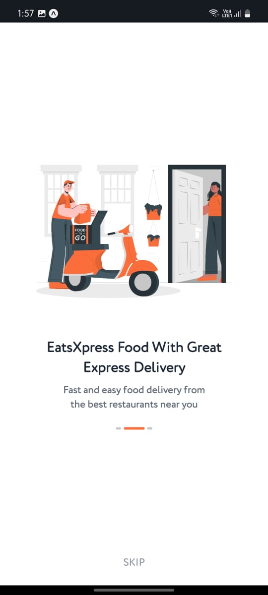
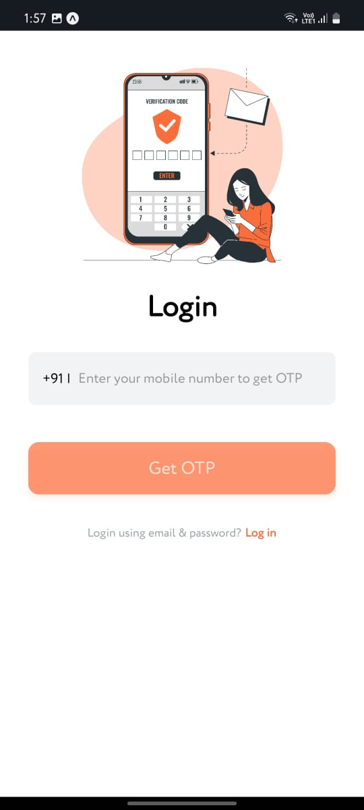
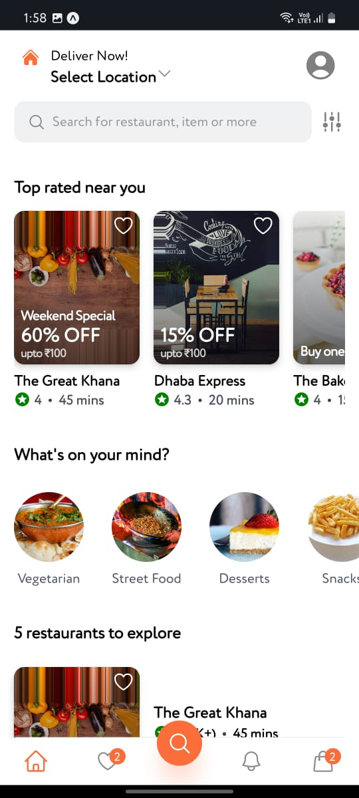
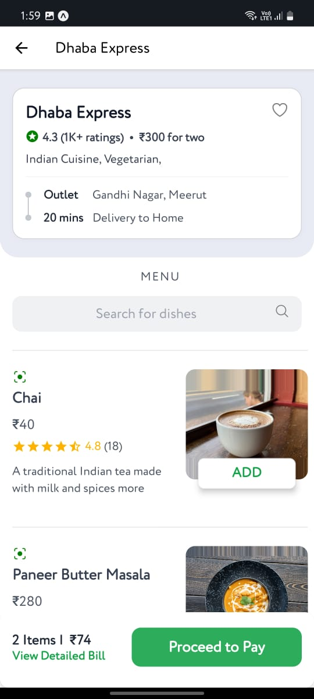
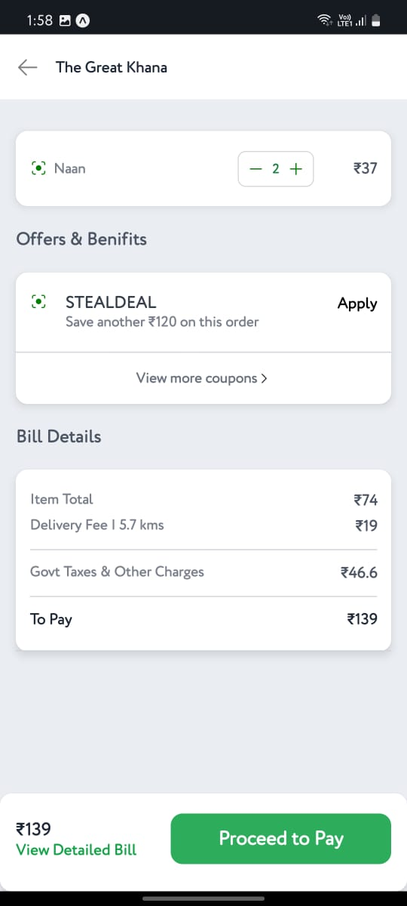
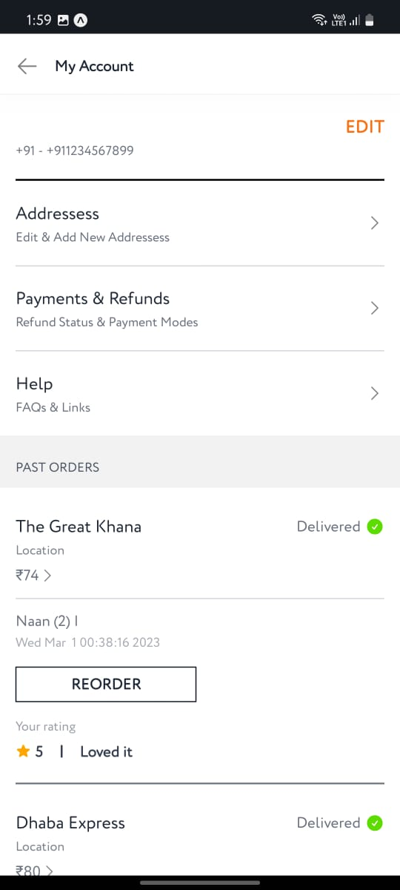
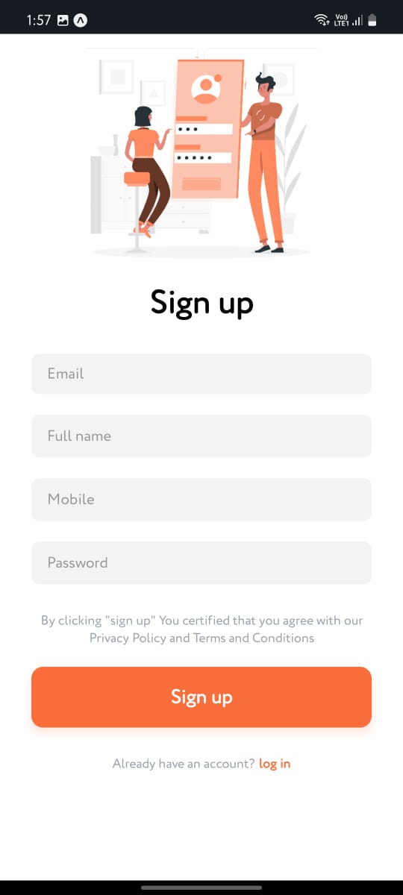

# EatsXpress

A cross-platform food delivery app built with **React Native and Expo**, inspired by apps like Swiggy. Browse restaurants, build a cart, pay and track your orders.

<p align="center">
  
  
  
  
</p>
<p align="center">
  
  
  
  
</p>

## Features

- Login with phone OTP or email and password (Firebase), plus onboarding screens
- Top-rated restaurants, categories, offers and search
- Delivery location picker with maps and directions
- Cart with coupons, a detailed bill and Razorpay payments
- Order status updates, past orders with one-tap reorder, and ratings
- Favorite restaurants
- Account page with addresses, payments and refunds, and help

## Tech stack

React Native · Expo (EAS) · Redux Toolkit · Redux Persist · Firebase Auth · Sanity CMS · React Navigation · React Native Maps · Reanimated · NativeWind · Razorpay

## Project structure

```
├── screens/      # app screens (Home, Restaurant, Cart, Delivery, Account…)
├── components/   # reusable UI (food cards, restaurant cards, tab bar, carousel)
├── features/     # Redux slices: auth, basket, favorites, location
├── stacks/       # auth and user navigation stacks
├── config/       # Firebase setup
└── Sanity.js     # CMS client for restaurant and menu data
```

## Run locally

```bash
npm install
npx expo start
```

You'll need your own Firebase project and Sanity project, configured in `config/Firebase.js` and `Sanity.js`.
